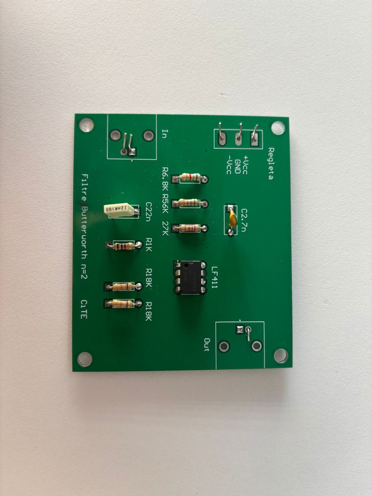
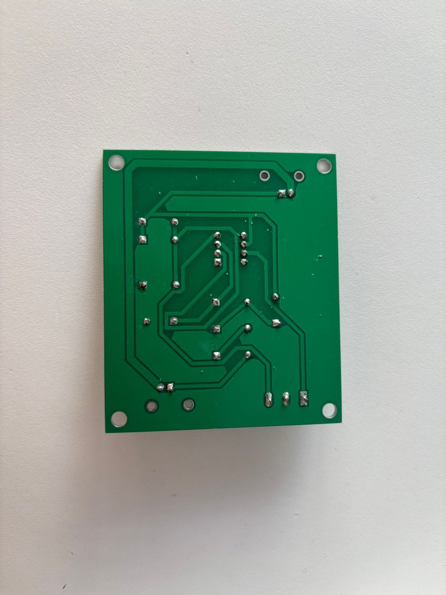
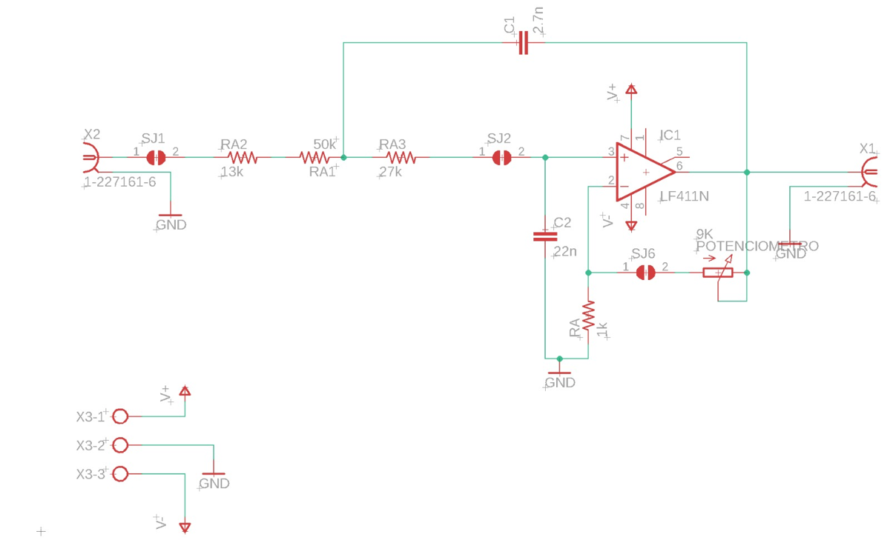
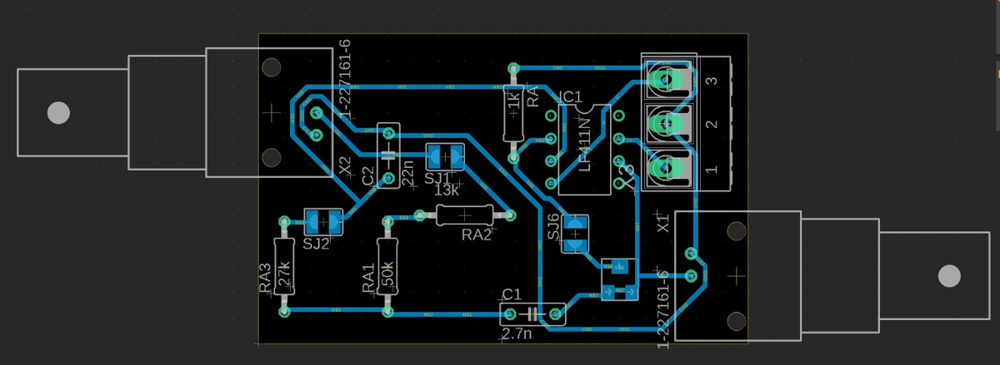
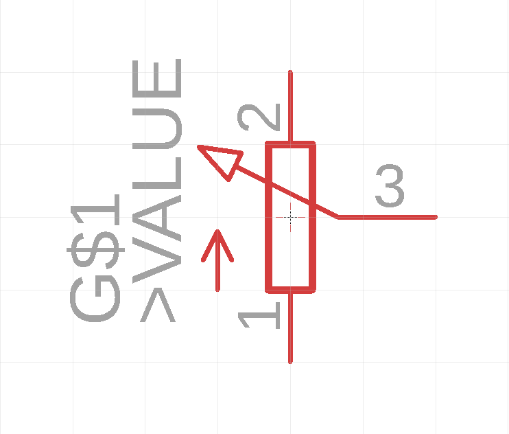
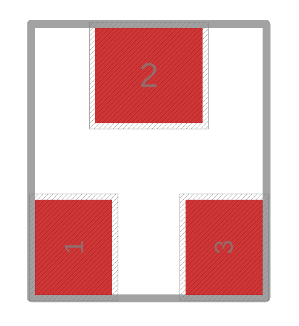
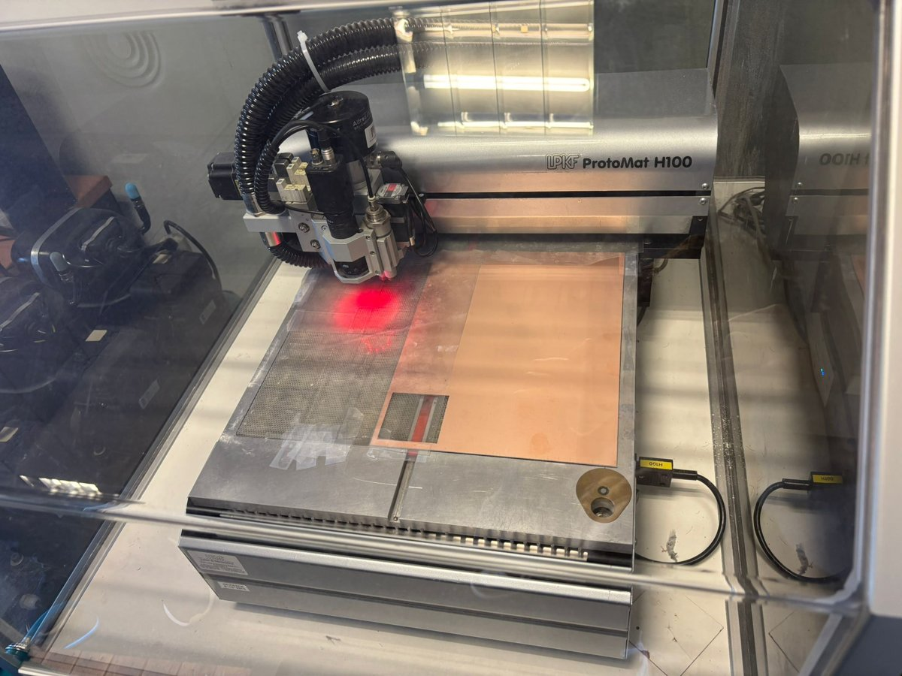
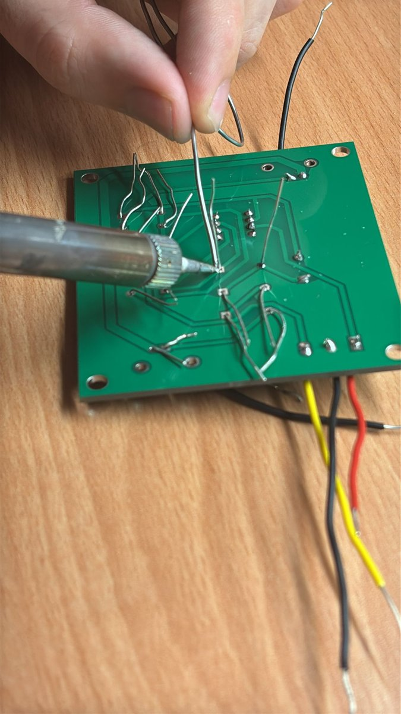
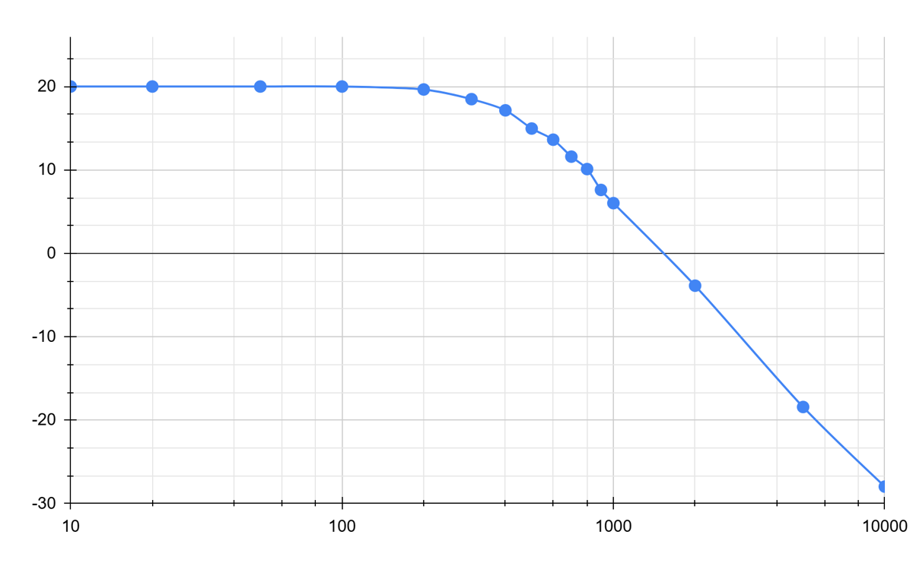
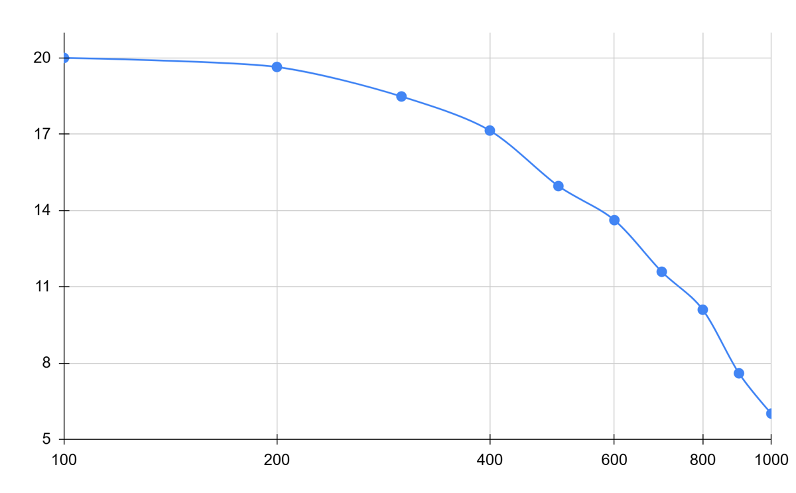

# Sallen-Key Butterworth Low-Pass Filter — PCB Design and Fabrication

<p align="center">
  
  &nbsp;
  
</p>

University project for the course **Circuits i Tecnologies Electròniques** (Computer Engineering and Telecommunication Electronics). It covers the full life cycle of an electronic prototype: theoretical design, schematic and layout in Autodesk Eagle, board fabrication, soldering and experimental verification in the lab.

## Specifications

| Parameter | Value |
|---|---|
| Type | Active low-pass, Butterworth, 2nd order |
| Topology | Sallen-Key with an LF411N op-amp |
| Cutoff frequency (design) | 500 Hz |
| Cutoff frequency (measured) | **≈ 410 Hz** |
| Passband gain | 10 (20 dB) |
| Quality factor | Q = 1/√2 |
| Roll-off | −40 dB/decade |
| Board size | 55 × 35 mm, single-sided (Bottom) |

## Schematic and layout

<p align="center">
  
</p>

<p align="center">
  
</p>

The cutoff frequency is given by

$$f_c = \frac{1}{2\pi\sqrt{R_A R_B C_1 C_2}}$$

with R<sub>A</sub> = 63 kΩ (built as 50 kΩ + 13 kΩ in series, based on what was available in the lab), R<sub>B</sub> = 27 kΩ, C<sub>1</sub> = 2.7 nF and C<sub>2</sub> = 22 nF, giving a theoretical 500.7 Hz. The gain is set by the negative feedback network, with 1 kΩ to ground and 9 kΩ.

Design rules: minimum trace width 0.508 mm, clearance 0.58 mm, routed on the Bottom layer with 45° bends.

### Custom part: Vishay TSM4 potentiometer

The standard Eagle libraries did not include the SMD potentiometer we wanted to use, so we modeled it from scratch (symbol, footprint based on the datasheet, and device). It is in [`hardware/POTENCIOMETRO.lbr`](hardware/POTENCIOMETRO.lbr).

<p align="center">
  
  &nbsp;&nbsp;
  
</p>

In the final assembly it was replaced with a fixed 9 kΩ resistor to simplify the circuit.

## Bill of materials

| Ref. | Value | Package |
|---|---|---|
| IC1 | LF411N | DIP-8 |
| R1.1, R1.2 | 50 kΩ + 13 kΩ | THT 0207 |
| R2 | 27 kΩ | THT 0207 |
| R5 | 1 kΩ | THT 0207 |
| 9K | 9 kΩ (TSM4 potentiometer in the design) | SMD TSM4 |
| C1 | 2.7 nF | THT, 5 mm pitch |
| C2 | 22 nF | THT, 5 mm pitch |
| X1, X2 | BNC coaxial connector (input/output) | AMP 227161 |
| X3 | 3-way terminal block (±V, GND) | AK500/3 |
| SJ1, SJ2, SJ6 | Solder jumpers | SJW |

## Fabrication

The final board was made by **mechanical milling** on an LPKF ProtoMat H100. We also tried and compared two other methods: 3D printing with silver ink (Voltera V-One) and chemical etching (photolithography). We also characterized the parasitics of the FR4 board (for example, about 346 pF of capacitance on a blank 7.4 × 10 cm board).

<p align="center">
  
  &nbsp;
  
</p>

## Results

We swept from 10 Hz to 10 kHz with a 1 V peak sine wave and measured the output on the oscilloscope.

<p align="center">
  
  
</p>

- The gain stays flat at 20 dB at low frequencies.
- The actual cutoff frequency (−3 dB) is around **410 Hz**, 18% below the design value. This is attributed to component tolerances (1–5% for resistors, 10% for capacitors) and to parasitic capacitance on the PCB.
- From about 700 Hz, the attenuation reaches the −40 dB/decade expected from a 2nd-order filter.

## Repository structure

```
├── hardware/
│   ├── CiTEsch2.sch         # Schematic (Eagle 9.6.2)
│   ├── CiTEsch2.brd         # PCB layout
│   └── POTENCIOMETRO.lbr    # TSM4 potentiometer library
└── docs/
    └── img/                 # Images used in this README
```

The `.sch` and `.brd` files open in Autodesk Eagle or Fusion (Electronics). They can also be imported into **KiCad** (free): *File → Import → Non-KiCad Project → Eagle*.

## Authors

- Guillem Simon Rodriguez
- Oriol Sanchez Romero

May 2026.
